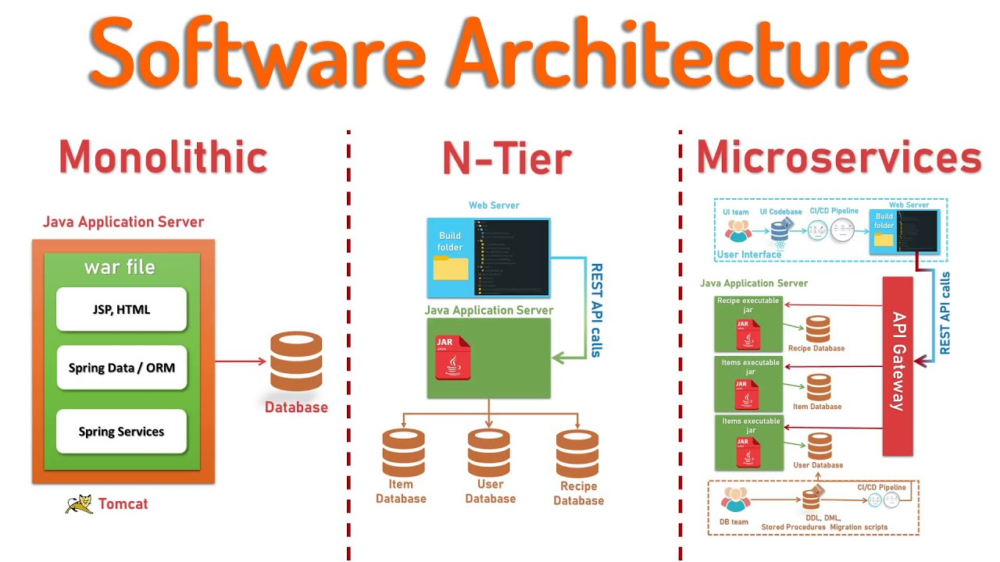

# Monolith architecture vs 2 Tier architecture

N-tier and monolithic architectures are two different approaches to designing software systems, each with its own advantages and disadvantages.
The main differences between monolith architecture and N-tier is that for N-tier the app and the database are on different machines. 

## Monolithic Architecture:
In a monolithic architecture, all the components of a software application are tightly integrated into a single codebase and deployed as a single unit. 
Typically, a monolithic application consists of a single executable or deployment artifact. 
Development, testing, deployment, and scaling are often simpler in monolithic architectures because there is only one codebase to manage. 
However, monolithic architectures can become cumbersome and difficult to maintain as the application grows larger and more complex. 
Scaling can also be a challenge because the entire application needs to be scaled horizontally, even if only a specific component requires more resources. 
## N-tier Architecture:
N-tier architecture divides the software application into multiple layers or tiers, each responsible for a specific aspect of the application's functionality. 
Common tiers include presentation (UI), business logic, data access, and database layers. 
N-tier architectures promote modularity, scalability, and maintainability by separating concerns and allowing each tier to be developed, deployed, and scaled independently. 
Changes to one tier typically have fewer ripple effects on other tiers, making it easier to update and maintain the system over time. 
However, N-tier architectures can introduce complexity, especially in terms of communication and coordination between tiers. 

## Comparison:

- **Scalability:** N-tier architectures often offer better scalability because individual tiers can be scaled independently based on demand. Monolithic architectures may require scaling the entire application even if only one component needs more resources.
- **Maintenance:** Monolithic architectures can be simpler to maintain initially, but as the application grows, they can become harder to manage due to their tightly coupled nature. N-tier architectures promote modularity, making maintenance easier in the long run.
- **Development:** Monolithic architectures can be faster to develop initially because there's only one codebase to work with. N-tier architectures may require more upfront design and planning but can lead to a more flexible and maintainable system over time.
- **Complexity:** Monolithic architectures are generally simpler to understand and deploy, whereas N-tier architectures introduce additional complexity due to the separation of concerns and the need for communication between tiers.

## Summary
In summary, the choice between monolithic and N-tier architectures depends on factors such as the size and complexity of the application, scalability requirements, development team expertise, and long-term maintenance considerations.